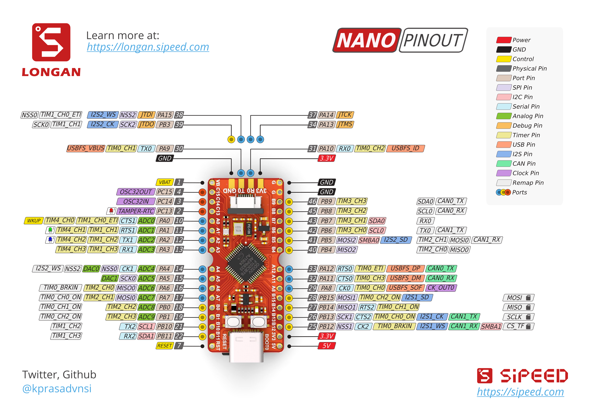

# Embedded operating systems with RISC-V on Longan Nano

## Longan Nano pinout



## Installing the toolchain

The RISC-V toolchain can be installed using these instructions:
[GitHub - riscv-collab/riscv-gnu-toolchain: GNU toolchain for RISC-V, including GCC](https://github.com/riscv-collab/riscv-gnu-toolchain)

On macOS the RISC-V toolchain can be installed using Homebrew by following the instructions here:
[GitHub - riscv-software-src/homebrew-riscv: homebrew (macOS) packages for RISC-V toolchain](https://github.com/riscv-software-src/homebrew-riscv)

## Flashing the board

Flashing the board can be done in multiple ways, all possible ways are detailed here:
[Programming the GD32V Longan Nano](https://appelsiini.net/2020/programming-gd32v-longan-nano/)

### Serial flashing

The easiest way to flash is using the serial bootloader than comes pre-programmed on the board. Instructions for installing the host side of the bootloader are available here:
[stm32flash / Wiki / Home](https://sourceforge.net/p/stm32flash/wiki/Home/)

On macOS the host side of the bootloader can be installed using Homebrew via the command:
```
brew install stm32flash
```

To get the board into bootloader mode press and hold the `BOOT` button on the board, then press and release the `RESET` button on the board, after this the `BOOT` button may be released. This will put the board in bootloader mode, now it can be programmed with the `stm32flash` tool via the following command:
```
stm32flash -g 0x08000000  -b 115200 -w app.bin /dev/<tty-device>
```

## Programming examples

The repo contains various examples for the peripherals and systems implemented, described here.

### GPIO

LED example - Controls the on board RGB LEDs, cycling between them to create various colors. 
Input example - Controls a GPIO's ouput state based on another GPIO's input state. Can be used to control an LED using a button.

### UART

UART example- Reads characters from UART 1 and echos them back.

### Kmalloc

Kmalloc example - Simple example that shows how to use the kmalloc.

### Thread

Thread example - Creates 25 threads and performs an addition on a global variable inside them, yielding in between them and ensuring the result is correct.
